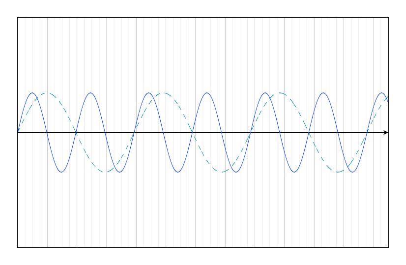
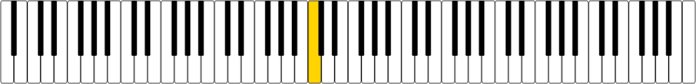

# Pitch

We want to model note pitch and its frequency. Some clues we have:

- Because of physics and how our inner ear and brain work, we perceive pitches logarithmically. A pitch twice the frequency of another pitch sounds "like the same note but higher".
  
- We are using an occidental music system.
- Each note name (A, B, C, D, E, F, G) has a corresponding [Pitch class](https://en.wikipedia.org/wiki/Pitch_class).
- Pitch and pitch classes can be represented using  [Integer notation](https://en.wikipedia.org/wiki/Pitch_class#Integer_notation).
- The musical pitch can be represented using [Scientific pitch notation](https://en.wikipedia.org/wiki/Scientific_pitch_notation)... But we haven't yet seen accidentals and we prefer to not implement them yet. 
- The frequency of a note is determined by its pitch class and its [Octave](https://en.wikipedia.org/wiki/Octave).
- We can use the piano keyboard as a reference for the pitch classes and their corresponding frequencies.
  
- [Middle C](https://en.wikipedia.org/wiki/C_(musical_note)#Middle_C) refers to the C note in the midle of a standard piano keyboard.
  
- We will assume the [A 440](https://en.wikipedia.org/wiki/A440_(pitch_standard)) pitch standard, which assumes the A above middle C is 440 Hz.